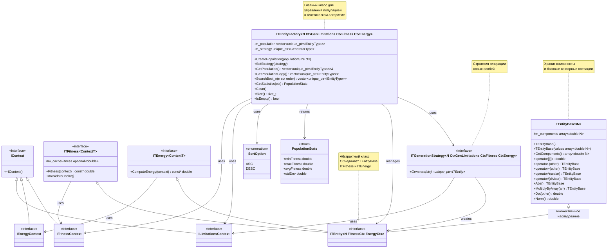
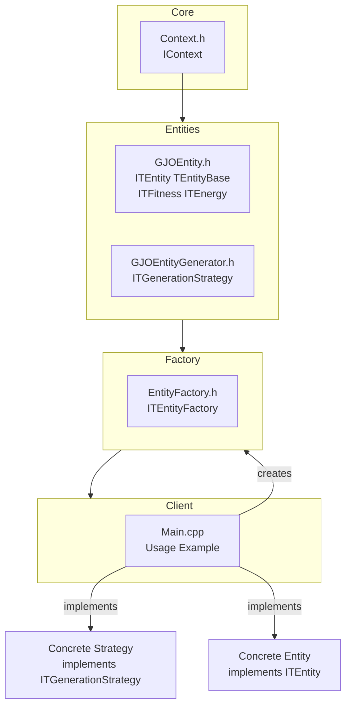

Классы и структуры архитектуры.


Общая файловая структура проекта разделение на клиентскую часть и часть за кадром


# Request Example
- POST http://localhost:8081/api/v1/compute
```json
{
  "dependencyContainer": {
    "estimator": {
      "coefficients": {
        "ThreatAvoidance": 1,
        "PathMinimizing": 0.2,
        "VarianceMinimizing": 0.2,
        "SmoothMaximizing": 0.2,
        "ThreatImportance": 0.2
      }
    },
    "updater": {
      "initialEnergy": 1.5,
      "maxIterations": 1000
    },
    "generator": {
      "limitationsX": {
        "min": 0,
        "max": 10
      },
      "limitationsY": {
        "min": 0,
        "max": 10
      },
      "limitationsZ": {
        "min": 0,
        "max": 10
      },
      "countWayPoints": 10,
      "maxGenerationIterations": 5
    }
  },
  "threats": [
    {
      "type": "airdefense",
      "center": {
        "x": 10,
        "y": 10,
        "z": 10
      },
      "radius": 10,
      "height": 10
    }
  ]
}
```